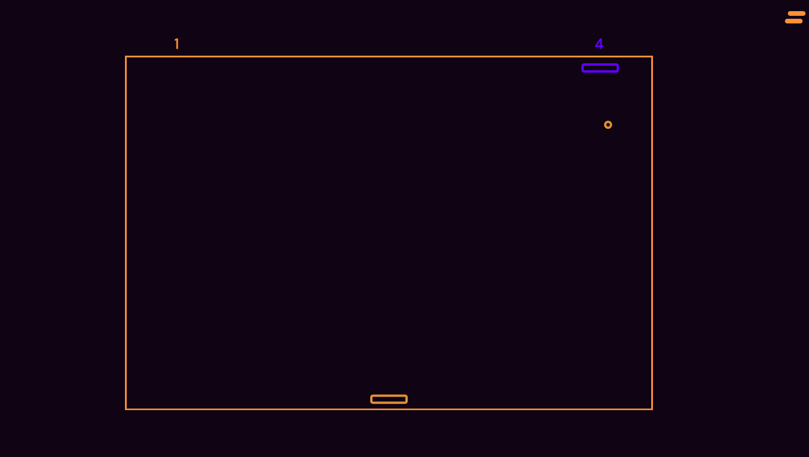
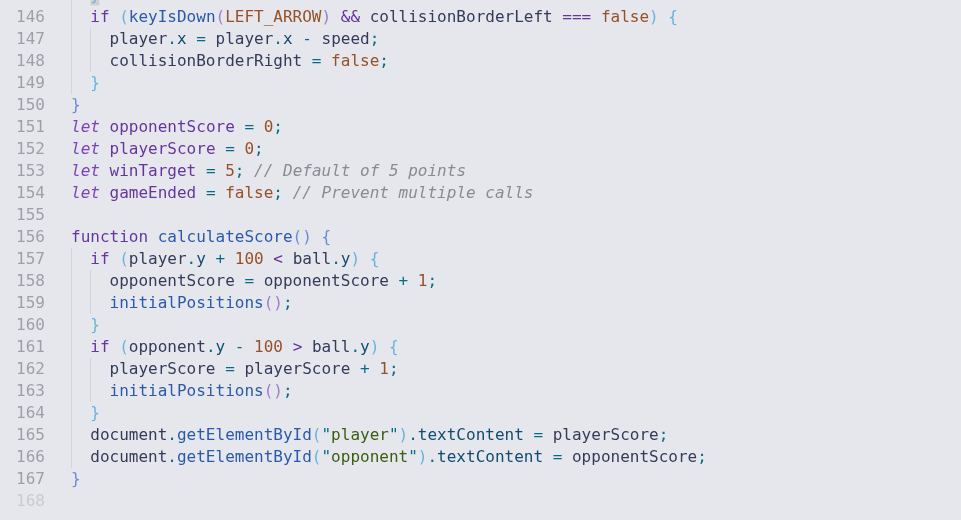
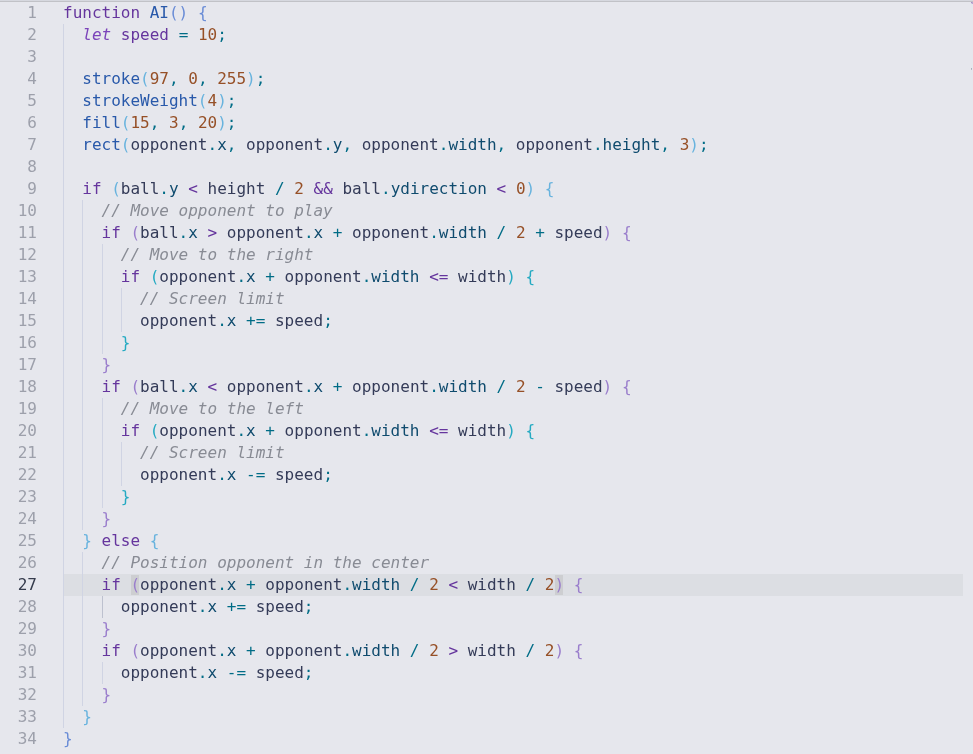
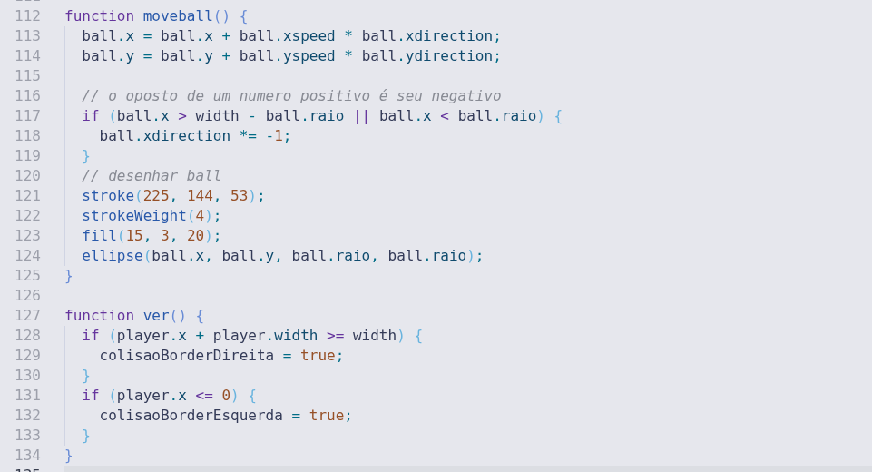

# Ping Pong Game: A Classic Arcade Recreation
> **This project is a Ping Pong game where you play against a bot.**
> The concept and visual style are inspired by the first Ping Pong games developed for computers, especially those created during the early decades of computer graphics.
> The purpose of this project is to explore a simple and straightforward approach, both in gameplay and technical implementation, prioritizing code clarity and component organization.

---

#### 1.1 Project and Implementation

The game was developed using the **p5.js** framework, which is focused on creative programming and simplifies the construction of visual elements through code.

One of the main reasons for choosing p5.js is the ability to build the entire graphical and logical structure of the game in an integrated way, using fewer lines of JavaScript code compared to more traditional approaches. In addition, the framework allows a clear separation between different game components, which contributes to better project organization.

The implementation is divided into multiple JavaScript files, where each file is responsible for a specific part of the game's functionality. This structure makes the code more readable and facilitates future modifications or expansions.

In the final execution flow, all these files are imported by a main file, which is responsible for bringing the scripts together, initializing the graphical environment, and running the game.

#### 1.2 Game Modes and Scoring System

In addition to the default gameplay, the project includes an option that allows the player to choose the number of points required to win the match. Before the game starts, an overlay menu is displayed where the player can select between predefined modes (1, 3, or 5 points).

This system is controlled by a configurable variable (winTarget), which defines the victory condition for both the player and the bot. Each time the ball passes beyond the opponent’s paddle, the corresponding score is incremented and the game elements are reset to their initial positions.

When either the player or the bot reaches the selected number of points, the game loop is interrupted and a victory screen is displayed. After a short delay, the game mode selection screen is shown again, allowing a new match to be started without reloading the page.

#### 1.3 Bot Movement and Ball Physics

The bot movement is based on a simple and deterministic artificial intelligence approach. The opponent paddle reacts to the horizontal position of the ball only when the ball is moving toward the top half of the screen. In this situation, the bot attempts to align its center with the ball’s x-axis position, moving left or right at a fixed speed.

When the ball is moving away from the bot, the opponent paddle gradually returns to the center of the screen. This behavior creates a balanced gameplay experience, as the bot is responsive but not perfectly precise, allowing the player to anticipate its movement.

The ball movement follows a basic physics simulation. Its position is updated every frame using horizontal and vertical speed values combined with directional multipliers. When the ball collides with the left or right borders of the canvas, the horizontal direction is inverted, creating the bouncing effect against the window edges.

Collisions with the player or opponent paddles invert the vertical direction of the ball. After each paddle collision, a small increment is applied to both the horizontal and vertical speeds, causing the ball to gradually accelerate as the match progresses. This mechanic increases difficulty over time while keeping the implementation simple and readable.

that's all... :)